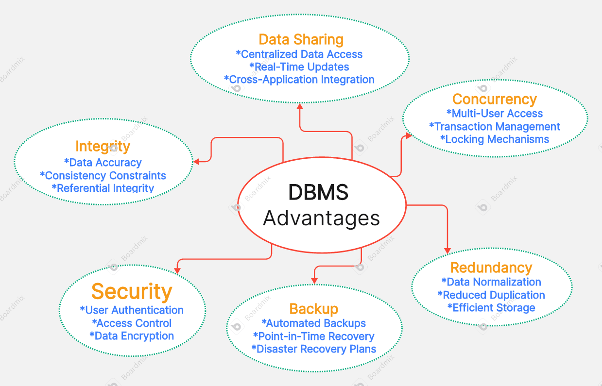

# _*1.Comparison Assignment*_ 

**_Flat File Systems vs. Relational Databases_**

| Feature              | Flat File Systems                                | Relational Databases                             |
|----------------------|---------------------------------------------------|--------------------------------------------------|
| **Structure**         | Data is stored in plain text or CSV files, with each file typically representing a single table. | Data is stored in structured tables with defined schemas (rows and columns). Tables can be linked. |
| **Data Redundancy**   | High – same data often needs to be duplicated across multiple files. | Low – data is normalized and redundancy is minimized through relationships. |
| **Relationships**     | No direct support – data linking must be manually handled, which can be error-prone. | Supports relationships through foreign keys and joins between tables. |
| **Example Usage**     | Simple contact lists, CSV exports, log files, flat configuration files. | Enterprise applications, inventory systems, customer relationship management (CRM) systems. |
| **Drawbacks**         | - Not scalable - Difficult to manage relationships - Higher risk of inconsistency - Poor performance with large data | - More complex to set up and maintain - Requires a database management system (DBMS) - Overhead for small/simple tasks |

# *__2. DBMS Advantages Mind Map__*

